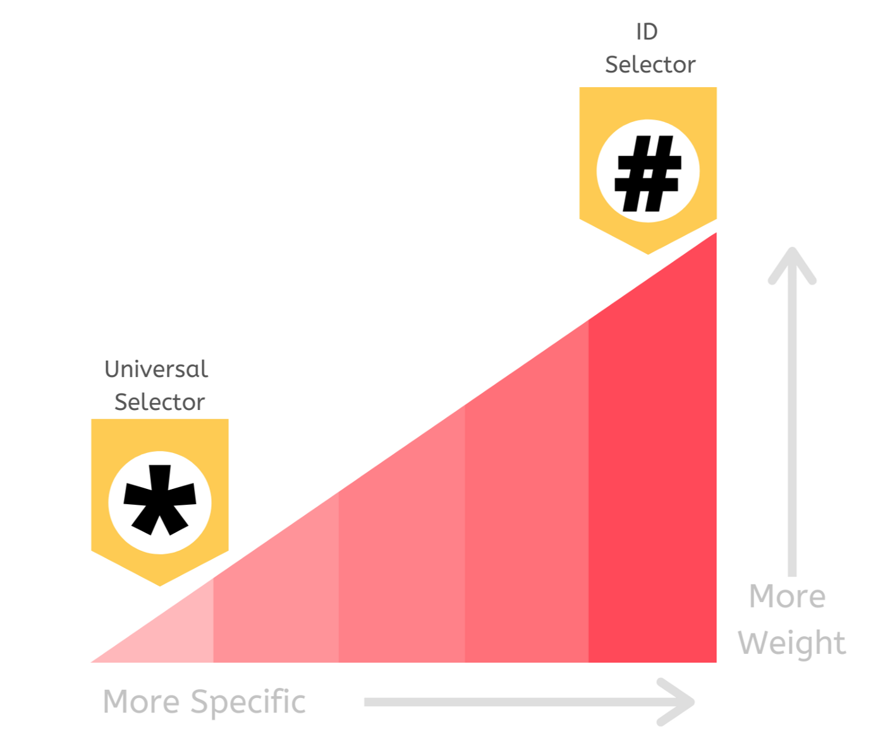
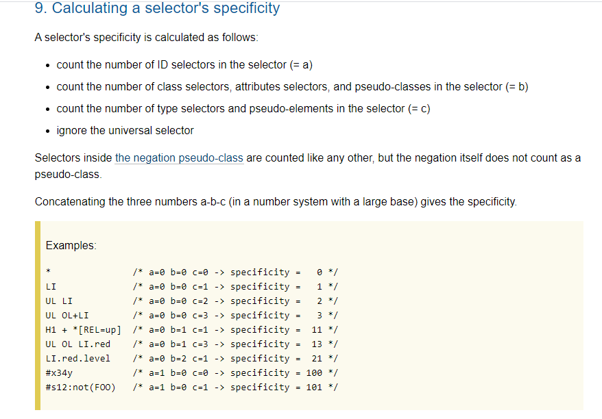
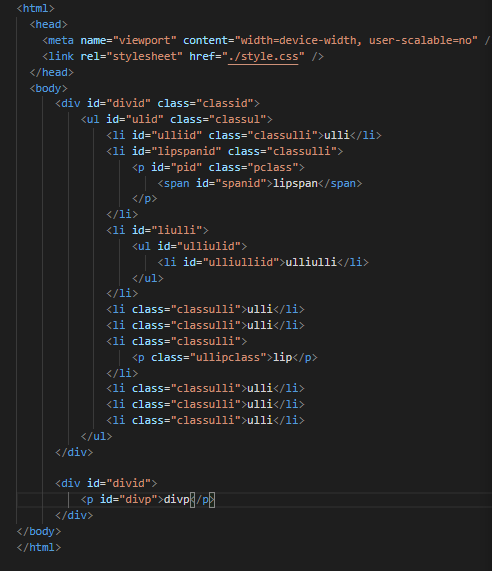
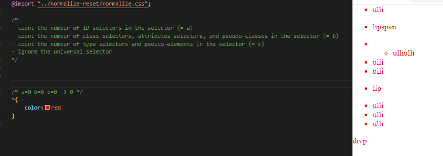
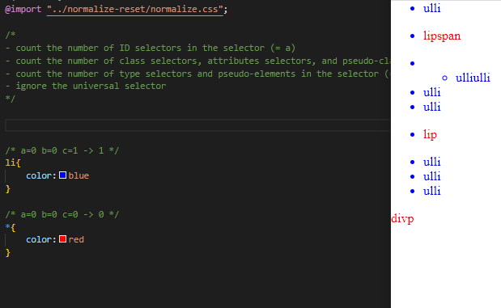
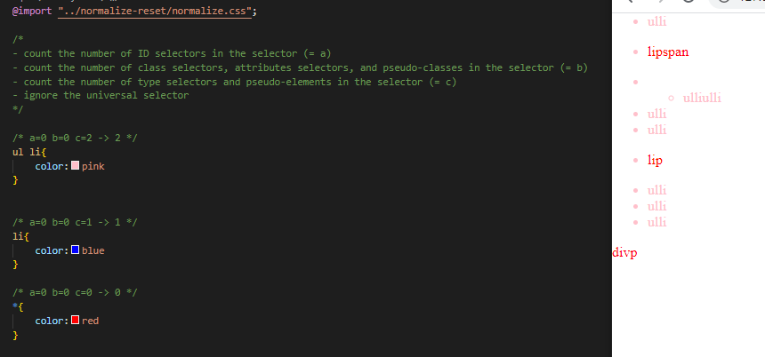
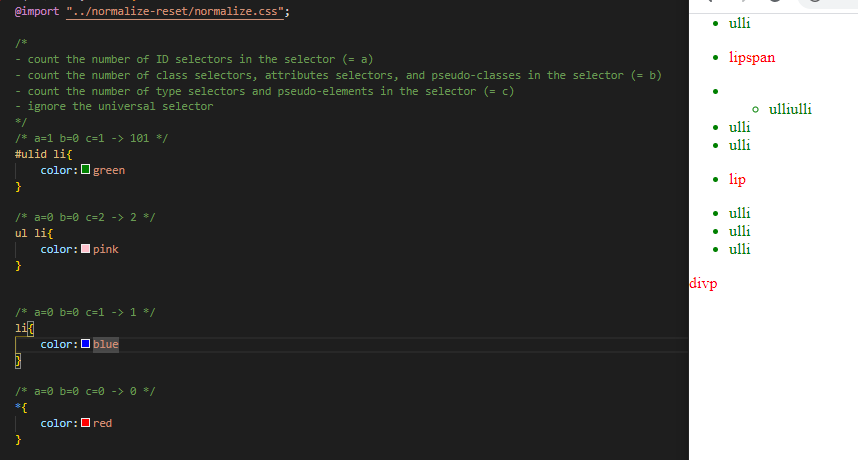

# CSS Specificity

Si hay dos o más reglas CSS que apuntan al mismo elemento y cambian la misma propiedad, el navegador le da más peso al que tiene el selector más específico.

Mientras más especifico es el selector más alto es la prioridad

fuente: <https://medium.com/@ae_cordova/avoid-headaches-by-understanding-css-specificity-4aa214557eb>

Para calcular la especificación se utiliza

fuente: <https://www.w3.org/TR/selectors-3/#specificity>

## Ejemplos

Utilizando esta arquitectura html

Indicamos que todo será color rojo

Todo element li será azul ( a pesar que * está debajo, se considera el selector con mayor especialización)

Volvemos a pisar el valor agregando más especialización

El uso de ID es el más alto

