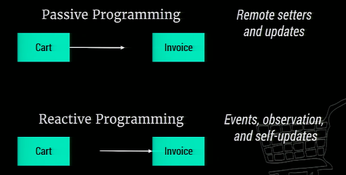

reactive programming
- Nuevo paradigma de programación para el manejo de estados de las variables. 
- Propagación automática de cambios
- Los modulos no esperan a que sus métodos de actualización de variables sean invocados para ejecutar el cambio. Tienen métodos que están escuchando cambios de otros módulos. Los métodos de eventos deben ser públicos para que otros módulos puedan preguntar por el estado.  
- Permite manipular stream de datos con funciones async

https://www.youtube.com/watch?v=49dMGC1hM1o

effect: Como mis módulos afectan a los demás módulos

Reactive Extension
API para programación asincrónica con flujos observables
ReactiveX is a combination of the best ideas from
the Observer pattern: Observador es un patrón de diseño de software que define una dependencia del tipo uno a muchos entre objetos, de manera que cuando uno de los objetos cambia su estado, notifica este cambio a todos los dependientes
the Iterator pattern : En diseño de software, el patrón de diseño Iterador, define una interfaz que declara los métodos necesarios para acceder secuencialmente a un grupo de objetos de una colección
and functional programming

RxJS is a library for reactive programming using Observables, to make it easier to compose asynchronous or callback-based code.

reactive programing ---> observable Pattern ---> Reactive Extensions(reactiveX) --->            rxjs                --> redux--> ngrx  
     Concepto       --->     Concepto       --->            Implementación      ---> Implementeación en javascript

https://en.wikipedia.org/wiki/Reactive_extensions
https://en.wikipedia.org/wiki/Asynchrony_(computer_programming)
https://en.wikipedia.org/wiki/Observer_pattern